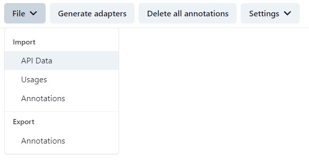
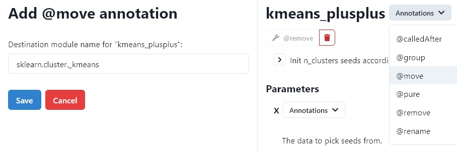
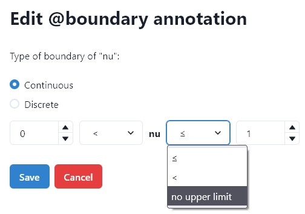
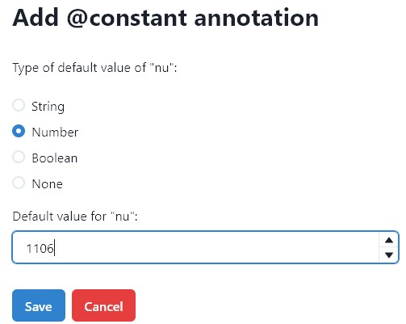
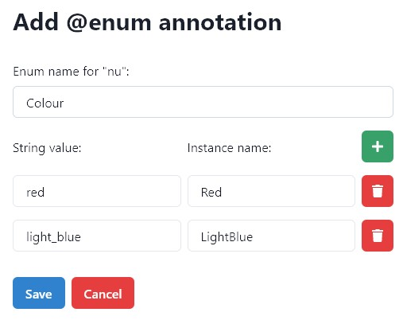
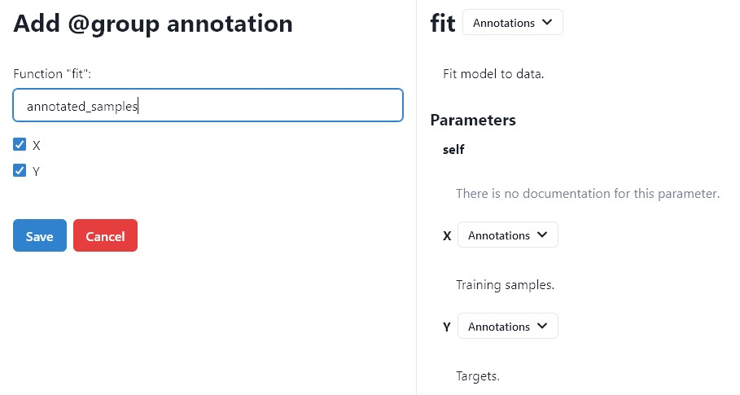
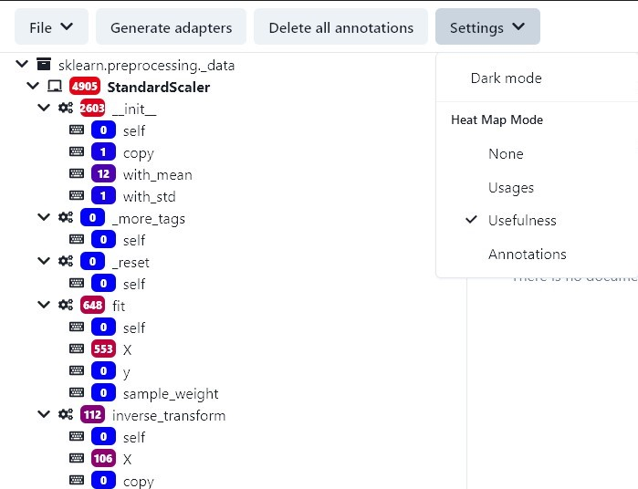
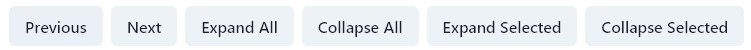

# Manual for api-editor
## General
The purpose of the _api-editor_ is to manually annotate classes, functions, and parameters from a given API
to generate an improved API. The _package-parser_, in contrast, marks annotations automatically.
These annotations can be imported, edited and deleted in the _api-editor_.

## Import
Before you can start adding own annotations, you need to import the [generated API, usages and annotations files](../package-parser/README.md) from _package-parser_.

Now you can select packages, classes, functions, or parameters from the tree view on the right side
and see the further information (documentation, annotation, etc.) about the selected element on the left side.

## Annotations
An improved API is created through annotations.
_Package-parser_ automatically generates some types of annotations by the documentation and the number of calls.
These are `Boundary`, `Constant`, `Enum`, `Optional`, `Remove`, and `Required`.
The other annotations cannot be generated, but are set manually with _api-editor_.

To add new annotations, select the corresponding class, function, or parameter in the tree view
and choose the desired annotation from the drop-down menu on the left.
On the right side, there is now an input for the creation of the annotation.
To edit an annotation, click on the annotation in the selected component of the API,
and to delete it, click on the red trash button on the right side of the annotation panel.

### List of annotations and their meaning
* ### Boundary
The annotation is used for numerical parameters, that should be in a specific range.
The interval can be open or closed, and can have no upper or lower limit.
_Continuous_ or _Discrete_ refers to the set of real numbers or integers.

* ### CalledAfter
When a function is usually been called after another function, it should be marked with a CalledAfter annotation.
The two functions must be in the same class.

* ### Constant
Parameters that are assigned only one value are marked with this annotation.
The function ``f(x, y)`` where x has a constant annotation will be a local variable with the result that ``f(y)`` has one parameter less.
Permitted types are primitive data types or None.

* ### Enum
The annotation is for string parameters that require specific words as input, and they should be converted to an enum.
Its elements contain a string value which is the value of the parameter and an instance name for the name of the element.

* ### Group
A group annotation is applicable on a function, but user-defined parameters are grouped into a single parameter in the enhanced API.
For that purpose, a new class with the selected parameters will be created.
The list of parameters of the method will contain the not selected parameters and one from the type of the new created class.

* ### Move
Classes with this annotation will be moved to a custom module.

* ### Optional
A new default value for the parameter should be added. e.g, The function ``f(x=1)`` would be converted to ``f(x)``.

* ### Pure

* ### Remove
A class or a function that is marked with this annotation should be removed.

* ### Rename
This annotation renames a class, function, or parameter.

* ### Required
An optional Parameter should be required. It is the opposite action of [Optional](#optional).

## Features
There are features for a better overview of the API and its usages.

### Filter
For a better listing, there is a text box filter in the top right corner that can filter the elements of the API.
The available commands for filtering are displayed when you press the help button on its right side.
If an ``!`` is before a command, it negates that filter.
Multiple commands are interpreted as an and operation.
The elements that meet the filter are printed in bold in the tree view.

### Heat Map
To get a heat map for the number of annotations or calls, go to Settings → Heat Map Mode and click on the desired view.
There are two options for the number of times the API is used.
_Usages_ shows the total number of calls and _usefullness_ subtract out the internal calls.
The third option is for the number of annotations that a class, function, or parameter has.

In the tree view of all components of the API,
the number of uses or the number of annotations of an individual component is color-coded in a box to the left of its name.
The warmer the color of the box, the more often the component is used or the more annotations it has.
The absolute number can be found in the box.

### Navigation bar

At the bottom right is a panel with six buttons for better handling of the tree view:
_Previous_ and _Next_ select the previous or next item in the tree view that meet the [filter](#filter).
The other four buttons expand or collapse the entire tree view or only the selected element and all elements contained in it recursively.

### Delete all annotations
On the menu bar is a button to delete all annotations. Use this button wisely, or export the annotations (File → Export → Annotations) before proceeding.

## Generate API
The button *Generate adapters* creates the improved API.
If there are any conflicts with annotations, they will be displayed and a new API won't be generated.
e.g, a module cannot have the annotations remove and move. One of them should be removed.
After generation, you can select the folder in which the file is to be stored.
It is a zip file with two folders. They are _adapter_ which contains the new API and [_stub_](https://simple-ml.de/).
