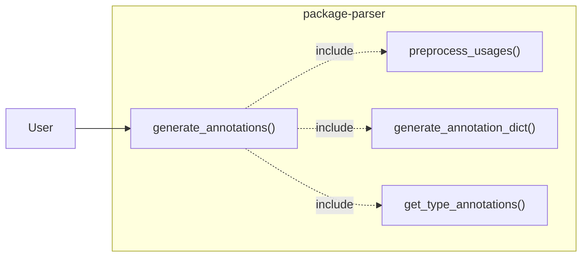
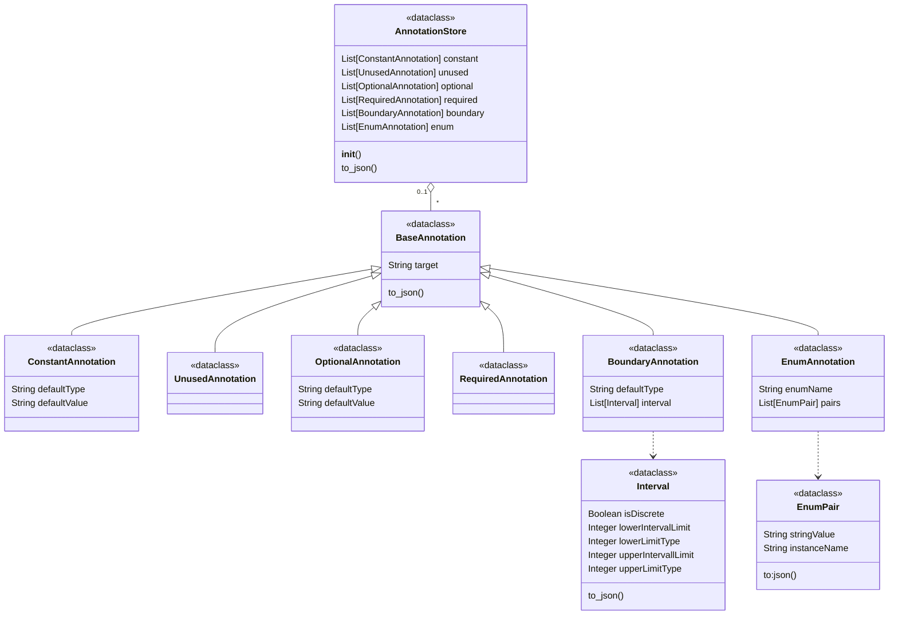
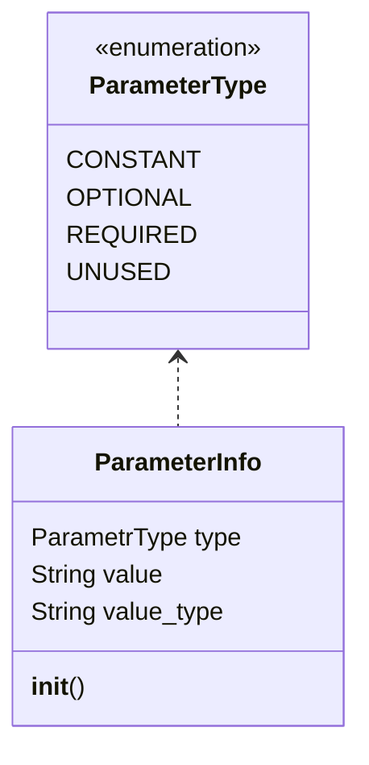
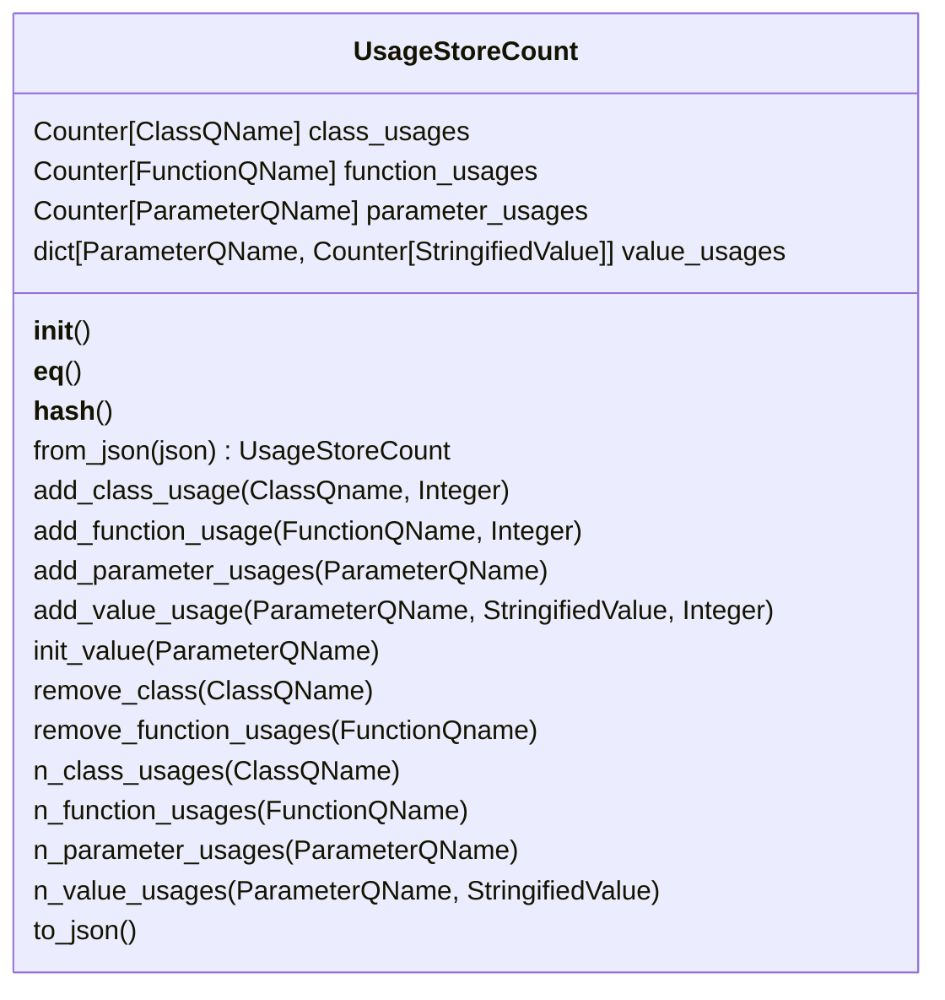
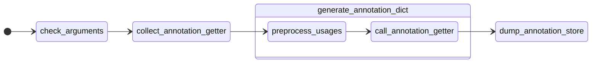

# Generate Annotations

This part of the package parser deals with the automatic generation of annotations that should help the user to quickly and efficiently correct various problems in an API. For this purpose, data from previously analyzed code is used and the generated annotations are stored in a JSON file.

## Main Functions

Can be found [here](package_parser/commands/generate_annotations/generate_annotations.py).

### `generate_annotations()`

Serves as a central function that takes care of inputs and outputs and bundles all underlying functions. The exact structure and a detailed view of its interaction with sub-functions will be explained further later.

### `preprocess_usages()`

Used to clean up the transferred analysis results and prepare them for further use.

### `generate_annotation_dict()`

Generates the various annotations by consecutively calling the passed functions and collects the partial results.

### `get_[type]_annotation()`

This name serves only as a placeholder. `[type]` must be replaced by one of the following keywords: {constant, unused, required, optional, boundary, enum}.

Generates the annotations of the corresponding type. All functions of this type have the following signature: `get_type_annotations(UsageCountStore, API, AnnotationsStore)`.
`UsageCountStore` and `API` represent the set of data extracted from the analyzed code. The functionality and task of the `AnnotationStore` will be explained later.

## Classes

We use the following dataclasses to store the related information. Compared to tuples, lists, and dictionaries, dataclasses offer better readability of the code and allow to define the interactions between functions in a clear and consistent way.

### AnnotationStore

Can be found [here](package_parser/models/annotation_models.py).

The AnnotationStore class is used for the collection of the individual annotations. An instance of this class is passed to the individual `get_[type]_annotation()` functions. These then place their results in the list assigned to them.

### ParameterType

Can be found [here](package_parser/models/annotation_models.py).

The ParameterInfo class is used to encapsulate the collected information for a given parameter which is generated in the `get_parameter_info()` function.

### UsageStoreCount

Can be found [here](package_parser/models/_usages.py).

This class is a slimmed down version of the [UsageStore](package_parser/commands/find_usages/_model.py) class.

For the automatic generation of annotations, it is in most cases sufficient to know how often a certain element (class, function, parameter, value) is used. In the original class, there are more details stored for each usage, which leads to a more complex and harder to use structure.

The methods of this class can be roughly divided into three categories:

#### Setter

All methods that start with add, remove or init are used to manipulate the counter of a specific element. The QName (QualifiedName) is used as a type of ID.

#### Getter

All methods that correspond to the form `n_[type]_usages()` are used to read out the number of usages of an element. The Qname is used in the same way here.

#### In-/Ouput

The methods `to_json()` and `from_json()` are used to store the content of the UsageCountStore as a json file or to read it from one.

## `generate_annotations()`

This function acts as the central interface for other parts of the program.

### Input

The function receives two filehandlers and a string that specifies a path.

The file handlers each point to a JSON file. This is the information collected during the code analysis.
The path specifies where the results are to be stored.

### `preprocess_usages()`

This function needs to be executed before the data can be analyzed and performs the following three tasks:

- `remove_internal_usages()`

  Since we are only concerned with the use of outward-facing package elements, all elements that are used exclusively internally are excluded from consideration.
  
- `add_unused_api_elements()`

  Some API elements are not used at all and, therefore, do not appear in the listing of all used elements. However, it is necessary that they do for the following process of the program.

- `add_implicit_usages_of_default_value()`

  If no value is supplied for an optional parameter when a function is called, the default value of the parameter is used implicitly. This implicit use of a value does not appear in the usage data. However, it is necessary that they do so for later analysis.

All functions of the form `get_[type]_annotation()` are passed in a list to the `generate_annotation_dict()` function. This function then calls them one after the other.

Finally, the data that resides in the `AnnotationStore` instance is stored in the output JSON file.

## Testing

### `AnnotationStore`

Can be found [here](tests/models/test_annotation_models.py).

For the `AnnotationStore` and all associated classes there are automatic tests that ensure that the `to_json()` methods work properly. For this purpose, a test configuration of the individual classes is created, and their output is then compared against the expected value.

### `UsageCountStore`

Can be found [here](tests/models/test_usages.py).

For this class, there are automatic checks for the input and output methods, that compare the actual result against the expected value. There are also various tests for every setter and getter in which the state of the object is checked after.

### `generate_annotations()`

The tests can be found [here](tests/commands/generate_annotations/test_generate_annotations.py) and the test data [here](tests/data).

For this function, all called functions are tested automatically. For this purpose, there is test data for each individual getter, for which the output is then compared against the expected value. We decided to split the test data and test the called functions as standalone, because the implementation of tests for new features would otherwise lead to a process of rechecking and updating all the previous tests and their data.
