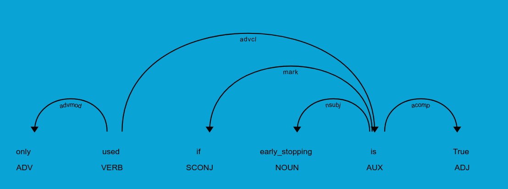

# Dependency Extaction

## How do we imagine a Dependency

A basic parameter dependency, what we are in this lab handling, is contained within a single sentence. In this sentence, we expect the identifying name of another parameter in the same function to appear, specifically in the dependency subtree of the condition.

## How do we extract a Dependency

Relying on spaCy's DependencyMatcher, we write functions to detect the head token of both the action and condition dependency subtrees. We assume that the action is always the root of the sentence, and a subtree inside the action contains the condition text.

Phrases are used to identify the type of the action/condition and create the appropriate model object.

Parsing a dependency subtree in an InOrder traversal, we can rebuild a sentence from the spaCy token objects.

### Dependency Tree Example

## Where to continue work?
* Development of more patterns in _dependency_patterns.py, see [Dependency Parser](https://spacy.io/usage/linguistic-features#dependency-parse), [Dependency Matcher](https://spacy.io/usage/rule-based-matching#dependencymatcher)
* Look into pattern matching over multiple sentences. Have a more theoretical understanding of the meaning of a dependency in the english language.
* Better classification of the subclasses of Actions, Condtions. These classes are found in __../get_api/_model.py__.

### How to continue work?
It is currently constructed such that for each pattern, there exists a corresponding function __extract_(pattern_name)__ within the class DependencyExtractor. This is due to the assumption that different types of dependency patterns will have different structured sentences, and thus require slightly different combinations of methods to extract the wanted information.

The exact naming of the function corresponding to the pattern is required for the pattern ID to name mapping, lines 188-190 in _get_dependency.py.
