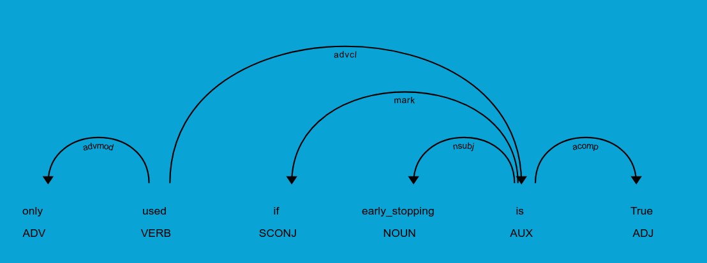

# Dependency Extaction

## How do we imagine a Dependency

A basic parameter dependency, what we are in this lab handling, is contained within a single sentence. In this sentence, we expect the identifying name of another parameter in the same function to appear, specifically in the dependency subtree of the condition.

## How do we extract a Dependency

Relying on spaCy's DependencyMatcher, we write functions to detect the head token of both the action and condition dependency subtrees. We assume that the action is always the root of the sentence, and a subtree inside the action contains the condition text.

Phrases are used to identify the type of the action/condition and create the appropriate model object.

Parsing a dependency subtree in an InOrder traversal, we can rebuild a sentence from the spaCy token objects.

### Dependency Tree Example

